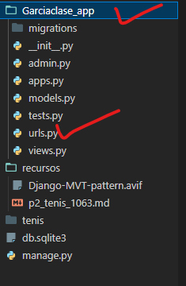
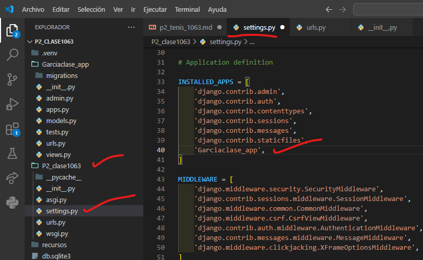
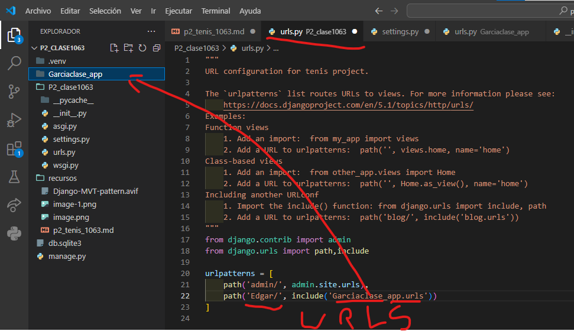
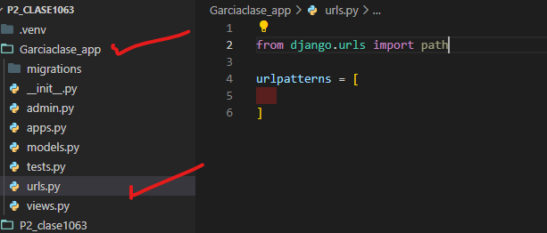

- crear aplicacion Garcia_app
- comando -->  python manage.py startapp Garcia_app
- creamos el archivo urls..py en Garcia_app
- 
- en sentting.py de P2_clase1063
- 
- en urls.py de P2_clase1063
- 
- en urls.py en Garciaclase_app
- 
- en views.py en navaclase_app
- 
- en urls.py en Garciaaclase_app
- 